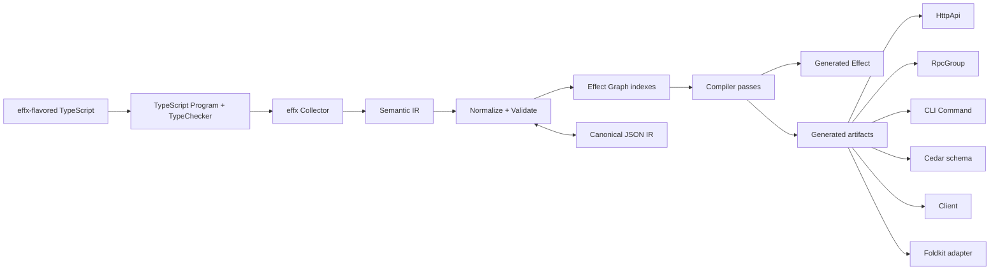
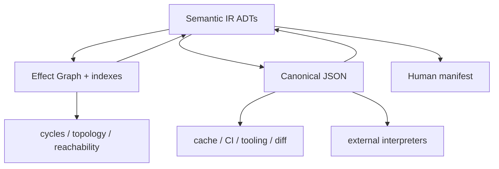
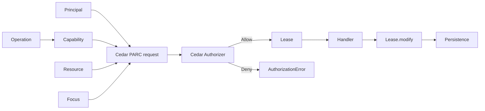
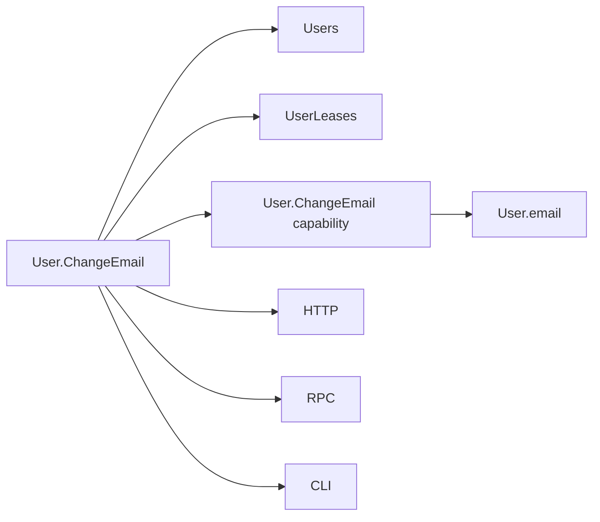

Operator-provided research report (2026-10-02). Inline citations were lost when the report was exported; claims are not individually sourced here. Primary-source verification for decisions lives in docs/specs and docs/research.

# effx Compiler/Framework: Minimal E2E MVP and Research Specification

## Executive summary

**effx should be built as an AOT application compiler for Effect v4, with Effect itself used to implement the compiler pipeline, a graph-shaped semantic IR used for analysis, and a canonical JSON projection used as the durable interchange/debug/cache format.** Runtime decorators should remain optional compatibility/introspection machinery rather than the source of truth.

The smallest credible MVP is not a general framework. It is one vertical proof that a single declaration can remove real boilerplate across the stack:

```text
Persistent Model
      ↓
Operation
 Query + Command
      ↓
Capability
      ↓
Handler : Effect<A, E, R>
      ↓
effx Application IR
      ↓
┌─────┼─────┬─────┐
HTTP  RPC   CLI   Cedar
│      │     │
└──────┼─────┘
       ↓
generated client
       ↓
Foldkit Command
```

The MVP should prove five things.

First, **effx can inspect real TypeScript and Effect types without executing application modules**. TypeScript's compiler API exposes the application as a `Program` containing `SourceFile` ASTs and supports diagnostics and emit, making an AOT analysis pass practical. 

Second, **the compiler can preserve, rather than reimplement, Effect semantics**. Effect v4 explicitly models `Effect<A, E, R>` as success `A`, typed failure `E`, and required services `R`; effx should extract these types and validate declarations against them instead of inventing another dependency/error system. 

Third, **schemas must remain live Effect Schema values**. The JSON IR should reference schemas rather than attempting to serialize their complete semantics. Effect's `SchemaAST` is a runtime tree with annotations, checks, encoding links, suspended schemas, declarations and other constructs; not every part has a faithful pure-JSON representation. 

Fourth, **authorization should be runtime Cedar authorization followed by capability construction**, not an attempt to replace authorization with TypeScript. Cedar's request model is explicitly principal/action/resource/context, with default-deny semantics and `forbid` overriding `permit`; its schema validator can detect invalid actions, entity types, resource applicability, attributes and type mismatches before requests run.  effx can exploit this to provide very fast compile/watch-time feedback while still performing the security decision at runtime.

Fifth, **the IR should itself become a product**. It should power code generation, inspection, authorization validation, architecture graphs, migration tooling, future Effect Cluster lowering, and eventually agent tooling.

My recommended architecture is:



The key architectural choice is **not Graph IR versus JSON IR** and not **Effect compiler versus JSON-first compiler**. These should be complementary:

> **The semantic IR is graph-shaped. Effect `Graph`, `HashMap`, `Trie`, etc. are compiler working structures. Effect Schema defines the durable IR data model. Canonical JSON is its stable serialized projection.**

That gives effx strong internal analysis without making an implementation data structure part of the external compatibility contract.

The first Vektorprogrammet prototype should deliberately exclude database migration generation, Cluster, sync, custom TypeScript grammar and `@Service interface` sugar. Those belong behind proven extension points. The first slice should instead demonstrate the whole loop with one persistent `User` model, one `GetUser` query, one `ChangeUserEmail` command, scoped read/write capabilities, Cedar authorization, HTTP/RPC/CLI generation, a generated client and one Foldkit command.

The connected `vektorprogrammet/vektorprogrammet` default branch I can currently inspect appears to be the older PHP/Symfony-era application with Gulp and legacy JavaScript dependencies rather than an Effect application. fileciteturn2file0L1-L13 I would therefore keep the experiment **self-contained**—for example an `effx-lab` package/branch or a dedicated modern package—rather than entangling the compiler prototype with that legacy build until the compiler has a stable shape.

## Compiler and IR architecture

### AOT should be primary; runtime decorators should be secondary

There are three plausible approaches:

| Architecture | Strengths | Weaknesses | Recommendation |
|---|---|---|---|
| Runtime decorators/reflection | Minimal build tooling; direct metadata at runtime | Cannot recover erased TS types; requires executing modules; poor fit for E/R inference; initialization/order/cycle issues | Do not use as compiler foundation |
| TypeScript AOT compiler | Full AST + TypeChecker; can infer `E`/`R`; deterministic generation; no user-code execution | Compiler API complexity; TypeScript-version coupling | **Primary MVP architecture** |
| Hybrid AOT + runtime metadata | Strong compile-time analysis plus runtime introspection/plugin possibilities | Two surfaces to keep coherent | **Long-term target** |

Current JavaScript decorator work reinforces this choice. As of October 2, 2026, TC39's core decorators repository reports **Stage 2.7**, while the separate decorator-metadata proposal reports **Stage 3**. Core decorators are functions applied during class/class-element definition and may replace a decorated value with a semantically corresponding value.  TypeScript has supported its standards-oriented decorator implementation since TypeScript 5.0, but that system differs materially from legacy decorators, including incompatibility with `emitDecoratorMetadata` and lack of parameter decorators. 

That means effx should treat:

```ts
@Query(...)
@Http.Get(...)
@Rpc(...)
static getUser(...) {
  ...
}
```

as **source syntax that the AOT collector recognizes**, rather than depending on decorator execution to construct the application.

The runtime implementations of these decorators can consequently be tiny and standards-compatible. They may add metadata for runtime inspection, or effectively be no-ops. The compiler semantics live elsewhere.

This also provides protection against decorator-spec churn.

### Decorators should annotate; the compiler should interpret

A useful rule is:

```text
decorator ≠ generated behavior
decorator = contribution to semantic IR
```

For example:

```ts
@Query({
  input: GetUserInput,
  success: User.Public
})
@Http.Get("/users/:id")
@Rpc("User.Get")
@Cli("users get")
@Authorize(UserCapability.Read)
static getUser(input: GetUserInput) {
  return Effect.gen(function*() {
    const users = yield* Users
    return yield* users.get(input.id)
  })
}
```

is interpreted approximately as:

```text
Operation User.Get
├── kind           Query
├── input          schema:GetUserInput
├── success        schema:User.Public
├── errors         inferred
├── requirements   inferred
├── authority      User.Read
├── handler        symbol:UserOperations.getUser
└── exposures
    ├── HTTP GET /users/:id
    ├── RPC User.Get
    └── CLI users get
```

The compiler should generate separate TypeScript rather than rewrite the method body.

That distinction lets raw Effect remain visible and usable.

### Methods are the best decorator target for the MVP

Current standard decorator syntax is centered on classes and class elements: classes, methods, fields, getters/setters and accessors.  There is a separate TC39 proposal exploring decorators for function declarations/expressions and object-literal elements, which is another reason not to make top-level decorated functions a prerequisite for effx's first version. 

For MVP syntax, prefer:

```ts
class UserOperations {
  @Query(...)
  static getUser(input: GetUserInput) {
    return Effect.gen(...)
  }
}
```

over:

```ts
class UserOperations {
  @Query(...)
  static getUser = Effect.fn(...)
}
```

The latter is analyzable AOT, but standards field decorators have different runtime semantics from method decorators: a field decorator does not simply receive the final initialized field value in the same way a method decorator receives a method. 

Methods therefore align static analysis, ordinary JavaScript semantics and human expectations.

### `@Service interface` should be future compiler sugar, not MVP syntax

This desirable surface:

```ts
@Service
interface Users {
  get(...)
  insert(...)
  update(...)
}
```

cannot be implemented as an ordinary standards-compliant JavaScript decorator because interfaces are TypeScript type declarations with no corresponding JavaScript class value, while the current core decorator model operates on JavaScript classes and class elements. This is an inference from the TypeScript/TC39 language boundary, not a limitation effx itself must accept permanently. 

There are three possible future designs:

| Service sugar | Cost | Recommendation |
|---|---:|---|
| `Service.define<Users>("Users")` companion value | Very low | Provide early |
| `@Service()` on an abstract/runtime class | Low-medium | Explore after MVP |
| `@Service interface Users` | Requires pre-parser/custom grammar/compiler extension | Only after effx proves enough value to justify custom syntax |

The important future property is that the sugar lowers to normal Effect `Context` service keys/classes and `Layer`s. It should not introduce an effx DI runtime.

### The TypeScript frontend should be isolated behind an adapter

The AOT frontend should use the TypeScript compiler model:

```text
Program
├── SourceFiles
├── TypeChecker
├── Diagnostics
└── Emit facilities
```

which is exactly the set of primitives Microsoft's compiler API exposes. 

But effx should hide it behind:

```ts
interface SourceFrontend {
  readonly analyze:
    (project: ProjectConfig) =>
      Effect.Effect<SourceProgram, CompilerFault>
}
```

The official TypeScript compiler-API documentation has itself warned about significant API evolution around newer TypeScript generations, so containing compiler-specific code is important. 

Do not let `ts.Node`, `ts.Type`, `ts.Symbol`, etc. escape into the semantic IR.

### Graph IR versus JSON IR is a false choice

Effect v4's `Graph` already provides immutable and scoped-mutable directed/undirected graphs, user-defined node/edge data, traversal, analysis, path-finding and transformation algorithms.  That is excellent compiler machinery.

But `Graph` should not itself define effx's compatibility format.

Recommended layering:



Define a versioned semantic structure first:

```ts
interface ApplicationIR {
  readonly format: "effx-ir"
  readonly version: 1
  readonly nodes: ReadonlyArray<NodeIR>
  readonly edges: ReadonlyArray<EdgeIR>
}

type NodeIR =
  | SchemaNode
  | ModelNode
  | ServiceNode
  | OperationNode
  | CapabilityNode
  | ProjectionNode
  | EntityNode

type EdgeIR =
  | InputOf
  | SuccessOf
  | ErrorOf
  | Requires
  | AuthorizedBy
  | Focuses
  | ExposedAs
  | PersistsAs
```

At analysis time:

```text
ApplicationIR
     ↓
stable-id index
     ↓
Effect.Graph<NodeIR, EdgeIR>
     +
Trie<qualified-name, StableId>
     +
HashMap<StableId, NodeIR>
```

`Trie` is useful for symbol namespaces, route/operation prefixes and qualified-name lookup. `Graph` is useful for actual semantics: dependency cycles, reachability, capability inheritance, generated projection dependencies and topological build ordering. Those should remain **indexes/views over IR**, not the wire format.

### JSON should be canonical, versioned and boring

Canonical JSON matters because the same application graph should produce the same:

- cache key,
- manifest,
- diff,
- snapshot,
- CI artifact,
- agent/tool input.

RFC 8785's JSON Canonicalization Scheme provides deterministic object-property serialization, but array ordering remains meaningful, so effx must normalize semantically unordered arrays before encoding them. 

I would define:

```json
{
  "format": "effx-ir",
  "version": 1,
  "nodes": [],
  "edges": []
}
```

with normalization rules:

```text
nodes     sorted by stable semantic ID
edges     sorted by (kind, from, to, qualifier)
sets      sorted by canonical element encoding
maps      canonical object-key ordering
unions    canonical tag
source locations excluded from semantic hash
```

Keep compiler/debug information separate:

```text
effx.ir.json
    canonical semantic artifact

effx.manifest.json
    source locations
    compiler version
    generated files
    diagnostics
    semantic hash
```

This prevents moving a declaration from line 80 to line 90 from changing the semantic IR.

Version migrations should themselves be functions:

```text
IR v1 → IR v2 → IR v3
```

rather than permissive readers containing years of branching logic.

### effx ↔ Effect is a partial isomorphism; Graph ↔ JSON can be a full one

The important distinction from our earlier discussion is:

```text
effx source ───────→ Effect normal form
     ↑                    │
     └──── recognized ────┘

Graph-shaped semantic IR ←→ canonical JSON IR
```

Arbitrary Effect programs are too expressive to lift back into effx declarations.

So define an explicit **effx-generated Effect normal form**:

```text
NF_effx ⊂ Effect programs
```

and test:

```text
lift(lower(source))
=
normalize(source)
```

only over that recognized subset.

By contrast, the IR serialization can have a strong round-trip law:

```text
decode(encode(graph))
=
normalize(graph)
```

### Property testing should define compiler correctness

Effect v4 now has its own `Arbitrary` module that can derive generators from Schema, shrink failures, replay them deterministically and test effectful properties via `checkEffect`; the module is currently marked unstable.  That makes it unusually well aligned with effx because the IR should itself be Effect-Schema-defined.

Core laws should include:

| Law | Property |
|---|---|
| IR round trip | `decode(encode(normalize(x))) == normalize(x)` |
| Canonicalization | `canonical(canonical(x)) == canonical(x)` |
| Normalization | `normalize(normalize(x)) == normalize(x)` |
| Graph projection | `fromGraph(toGraph(x)) == normalize(x)` |
| Source lowering | `lift(lower(x)) == normalize(x)` for supported effx syntax |
| Syntax equivalence | decorator API and builder API generate equal IR |
| Determinism | source/file ordering does not alter semantic hash |
| Projection coherence | HTTP/RPC/CLI expose the same logical input/success/error contract |
| Lease narrowing | focusing a lease never increases authority |
| Revocation | revoke is idempotent |
| Migration identity | `diff(schema, schema) == empty` |
| Migration application | `apply(A, diff(A,B)) == B` for supported transforms |

Because Effect `Arbitrary` is explicitly unstable, put it behind an effx testing adapter rather than leak its API into the public compiler contract. 

### Write the compiler in Effect, but do not make Effect data structures the file format

This is the best answer to the "compiler-in-Effect versus JSON-first" question.

| Choice | Advantages | Problems |
|---|---|---|
| Plain TS + JSON everywhere | Simple serialization; easy ecosystem interop | Awkward graph analysis; weaker resource/error architecture; duplicates facilities effx is meant to demonstrate |
| Effect Graph as canonical IR | Excellent analysis APIs | Couples external format to runtime representation; poor portability/versioning |
| **Effect compiler + Schema-defined IR + Graph indexes + JSON projection** | Typed compiler stages, dogfoods Effect, good analysis, stable external format | Slightly more architecture | **Recommended** |

Effect should structure the compiler itself:

```ts
type CompilerStage<I, O> =
  (
    input: I
  ) => Effect.Effect<
    StageResult<O>,
    CompilerFault,
    CompilerServices
  >
```

with an important subtlety:

> **Normal source diagnostics should be data, not Effect failures.**

A stage should be able to return fifty independent diagnostics. Reserve the Effect failure channel for things like an unreadable project, corrupted cache or compiler invariant violation.

That gives:

```ts
interface StageResult<A> {
  readonly value: Option.Option<A>
  readonly diagnostics: Chunk.Chunk<Diagnostic>
}
```

and lets Effect manage:

- filesystem/scopes,
- concurrent file analysis,
- compiler services,
- caching,
- tracing,
- incremental/watch resources,

while Graph/Trie/HashMap handle semantic analysis.

This is also strategically valuable: **effx should be a convincing example of what mature Effect architecture looks like after the boilerplate has been removed.**

## Surface language and Effect lowering

### The MVP source language should remain valid TypeScript

Do not introduce an effx grammar yet.

A representative source should look approximately like this:

```ts
@PersistentModel({
  table: "users"
})
export class User extends Model.Class<User>("User")({
  id: UserId,
  email: Email,
  displayName: DisplayName
}) {
  static readonly Public = /* derived schema */
  static readonly Self = /* derived schema */
}

export class UserOperations {
  @Query({
    input: GetUserInput,
    success: User.Public
  })
  @Http.Get("/users/:id")
  @Rpc("User.Get")
  @Cli("users get")
  @Authorize(UserCapability.Read, {
    resource: ({ id }) => User.resource(id)
  })
  static get(input: GetUserInput) {
    return Effect.gen(function*() {
      const users = yield* Users
      return yield* users.get(input.id)
    })
  }

  @Command({
    input: ChangeEmailInput,
    success: User.Self
  })
  @Http.Patch("/users/:id/email")
  @Rpc("User.ChangeEmail")
  @Cli("users change-email")
  @Authorize(UserCapability.ChangeEmail, {
    resource: ({ id }) => User.resource(id),
    focus: User.focus.email
  })
  static changeEmail(input: ChangeEmailInput) {
    return Effect.gen(function*() {
      // ...
    })
  }
}
```

Everything here should still lower to recognizable Effect.

### Input and success schemas should be explicit references

The compiler can infer TypeScript types, but a TypeScript type is not a runtime Effect Schema value.

Therefore this is insufficient:

```ts
@Query()
static get(input: GetUserInput):
  Effect.Effect<User, UserNotFound, Users>
```

for generating a runtime RPC or HTTP contract.

The compiler knows the types, but it does not automatically possess runtime codec values corresponding to those types.

The MVP contract should therefore explicitly name boundary schemas:

```ts
@Query({
  input: GetUserInput,
  success: User.Public
})
```

and treat them as **symbol references**.

Effect RPC itself follows this schema-backed model: an `Rpc` declaration records payload, success, error and other schemas, middleware/annotations and requirements, then clients and servers consume the same contract independently of transport. 

### Preserve schemas by reference, not serialization

An IR node should look like:

```ts
interface SchemaRef {
  readonly module: ModuleId
  readonly export: string
  readonly symbolId: StableId
  readonly typeDisplay?: string
}
```

not:

```ts
{
  "completeEffectSchemaAst": ...
}
```

Generated Effect code can then emit:

```ts
import { GetUserInput } from "../users/schemas"
import { User } from "../users/user"

Rpc.make("User.Get", {
  payload: GetUserInput,
  success: User.Public,
  ...
})
```

This retains the **actual schema value**.

Effect exposes Schema as a runtime AST with structured declarations, checks, annotations and transformations, so later tooling may inspect it in a controlled build worker.  But build-time module execution should be an explicit later feature, because importing arbitrary application modules during compilation introduces side effects and ordering hazards.

For MVP:

```text
AOT compiler
    ↓
preserves SchemaRef
    ↓
generated TS imports actual Schema
    ↓
Effect performs runtime encoding/decoding
```

This is both safer and simpler.

### Infer `E` and `R`; check them when declared

Effect v4 explicitly defines:

```text
Effect<A, E, R>

A = success
E = typed failures
R = required services
```


That is one of effx's highest-value compiler opportunities.

Given:

```ts
static get(input: GetUserInput) {
  return Effect.gen(function*() {
    const users = yield* Users
    const audit = yield* Audit

    const user = yield* users.get(input.id)
    yield* audit.readUser(input.id)

    return user
  })
}
```

the TypeChecker should inspect the final return type and derive something equivalent to:

```text
success:
  User

errors:
  UserNotFound | DatabaseError | AuditError

requirements:
  Users | Audit
```

This information becomes IR.

When omitted:

```ts
@Query(...)
```

means:

```text
errors       := infer E
requirements := infer R
```

When specified:

```ts
@Errors(UserNotFound, DatabaseError)
@Requirements(Users, Audit)
```

effx should perform an **exact check by default**:

```text
declared errors       == inferred schema-addressable E
declared requirements == inferred stable R symbols
```

rather than blindly replacing inference.

The result is useful diagnostics:

```text
EFFX2201 Undeclared error

UserOperations.get

Handler returns:
  UserNotFound | DatabaseError | AuditError

@Errors declares:
  UserNotFound | DatabaseError

Missing:
  AuditError
```

or:

```text
EFFX2303 Stale requirement

@Requirements declares:
  Users | Audit

Actual Effect requires:
  Users

Audit is no longer required.
```

This makes optional declarations function as **assertions**.

### `E` inference needs a schema-addressability rule

There is a distinction between:

```text
TypeScript knows this error type
```

and:

```text
effx can encode this error at an HTTP/RPC boundary
```

So define:

```text
SchemaAddressable(E)
```

An inferred error constituent is schema-addressable when the compiler can resolve it to a runtime Effect Schema value—for example a known exported Schema error class or explicitly registered schema reference.

Then:

```text
infer E
      │
      ├── every constituent schema-addressable
      │       → generate automatically
      │
      └── opaque constituent
              → diagnostic requesting @Errors mapping
```

This is safer than pretending TypeScript's erased types can become wire codecs.

### `R` inference similarly requires stable service identities

`R` may contain structural or aliased types that do not correspond cleanly to a runtime service declaration.

So requirements should have stable effx identities:

```text
service:Users
service:Audit
service:Clock
```

where possible.

The compiler checks the Effect return type against exported/registered Effect `Context` service symbols.

Effect's own API makes required services visible in `R`; for example accessing a context service produces an Effect requiring that service identifier. 

If the compiler encounters an anonymous structural requirement that cannot be linked to a stable service declaration, it should emit:

```text
Cannot assign stable effx identity to requirement X.
Declare or register the service explicitly.
```

rather than invent an ID from a pretty-printed type.

### `@Query` and `@Command` are semantic claims, not inferred purity

This is crucial.

`Effect<A,E,R>` does **not** tell effx whether a computation mutates business state.

Two programs may have identical `A`, `E`, and `R` while one reads and one writes.

Therefore:

```ts
@Query
```

cannot mean:

> effx has mathematically proved this Effect is pure/read-only.

It means:

> the developer declares this operation to have query semantics.

The compiler can then **check what it can know**.

For example:

```text
Query
  ├─ calling another Command              ERROR
  ├─ requiring service classified Write   ERROR/WARN
  ├─ obtaining WriteLease                 ERROR
  ├─ calling known mutating repository op ERROR
  └─ arbitrary raw Effect                 UNKNOWN
```

This gives useful enforcement without false confidence.

The core MVP should support only:

| Kind | Meaning |
|---|---|
| `Query` | Declared observational/read operation |
| `Command` | Declared business-state-changing operation |

Later, separate concerns rather than inflate one enum.

I recommend:

```text
Action
    = neutral/general effectful application operation

Mutation
    = client/cache projection of a Command
```

rather than making `Mutation` a third backend ontology.

This lines up well with Effect's current Atom RPC/HTTP APIs, which themselves expose **query** and **mutation** helpers, with successful mutations able to invalidate reactivity keys.  Those APIs are currently marked unstable, so effx should adapt to them rather than encode their exact API into its IR. 

### Lowering should be explicit enough to inspect

A source operation:

```ts
@Query({ input: GetUserInput, success: User.Public })
@Rpc("User.Get")
@Http.Get("/users/:id")
static get(input: GetUserInput) {
  return ...
}
```

might lower into generated modules:

```text
.effx/generated/
├── operations.ts
├── http.ts
├── rpc.ts
├── cli.ts
├── client.ts
├── auth.ts
├── foldkit.ts
└── manifest.ts
```

The generated RPC layer should use Effect `Rpc`; the HTTP layer should use `HttpApi`; the CLI layer should use Effect CLI.

Effect's `HttpApi` reflection exposes endpoint/groups plus merged annotations, middleware, success schemas and error schemas, making it suitable as a generated target rather than something effx needs to emulate.  Effect's CLI `Command` similarly combines typed arguments/flags, metadata and an effectful handler, though that module is currently marked unstable. 

The compiler should emit a comment header:

```ts
// Generated by effx. Do not edit.
// Source: UserOperations.get
// IR: op:users/User.Get
```

so developers can always traverse from source → IR → generated Effect.

## Authority, data, and distributed semantics

### The capability model should separate four things

Authorization becomes much clearer if effx separates:

```text
Capability
Resource
Focus
Lease
```

A useful model is:

```ts
Capability<Action>

Resource<Model, Id>

Focus<Root, Part>

Lease<
  Root,
  Part,
  Action,
  Scope
>
```

with semantics:

```text
Capability = kind of authority
Resource   = particular object being acted upon
Focus      = particular region of its data
Lease      = scoped possession of approved authority
```

The runtime lease might resemble:

```ts
interface Lease<Root, Part, Action> {
  readonly resource: ResourceRef<Root>
  readonly focus: FocusRef<Root, Part>
  readonly capability: CapabilityRef<Action>
  readonly authorizationRevision: Revision
  readonly expires: Scope
}
```

### Effect Optics are a good execution primitive, but not the serialized identity

Effect's `Optic` module is explicitly designed for reading and immutably updating focused parts of a value; it supports record fields, union variants, optional values and traversals, with `.key(...)`, composition and modification operations. 

That makes Optics excellent for:

```text
Lease.modify(...)
```

but a raw runtime optic should not be the IR identity.

Instead define a serializable `FocusRef`:

```ts
{
  root: "model:User",
  path: ["email"]
}
```

and generate:

```ts
const UserEmail =
  Optic.id<User>().key("email")
```

at runtime.

This has several advantages:

- focus identities can appear in JSON,
- capabilities can be diffed,
- Cedar mappings can refer to them,
- inspectors can render them,
- generated clients can understand them,
- optics remain an implementation mechanism.

For Schema class instances specifically, the MVP research suite should explicitly test whether applying the chosen optic update preserves whatever class/prototype semantics the application relies on. Effect's Optic API is structurally typed over objects; effx should not assume every class-like domain object can safely be reconstructed with generic immutable object updates without testing that behavior. 

### Authorization should issue leases

The preferred flow is:



Cedar asks precisely whether a `principal` may perform an `action` against a `resource` in a `context`; it defaults to deny and lets matching `forbid` policies override matching permits. 

Map effx as follows:

| effx concept | Cedar |
|---|---|
| Principal | principal entity |
| Capability | action |
| Model/resource ID | resource entity |
| Capability group | action group |
| Resource relationships | entity parents/attributes |
| Request-specific facts | context |
| Grant | permit and/or entity membership |
| Guardrail/revocation override | forbid |
| Focus | usually action specialization; context when genuinely dynamic |

Cedar schemas explicitly model principal/resource entity types, actions and action applicability; actions can belong to action groups.  That makes capability groups a natural compile target.

For example:

```text
User.ReadEmail
     └── member of User.Read

User.ChangeEmail
     └── member of User.Write
```

Do not encode every field as a Cedar resource entity. Keep the resource as:

```text
User::"123"
```

and make stable focus-sensitive permissions separate actions where security semantics genuinely differ.

### Access control can be by construction without pretending TypeScript is the security boundary

An important desired API is:

```ts
function changeEmail(
  lease: WriteLease<User, "email">,
  email: Email
): Effect<void, ...>
```

rather than:

```ts
function changeEmail(
  user: User,
  email: Email
): Effect<void, ...>
```

Only the authorization service creates a `WriteLease`.

That yields:

```text
no lease
  → no typed mutation API
```

which is very valuable architecture.

But this is **not a JavaScript security sandbox**. Application code capable of bypassing modules or importing lower-level persistence APIs may still circumvent the typed architecture. Cedar remains the runtime authorization enforcement point.

So the model is:

> **Construction prevents accidental authority misuse; Cedar prevents unauthorized requests.**

### Leases should narrow monotonically

Starting from:

```text
Lease<User, User, Write>
```

a focus operation can derive:

```text
Lease<User, User.Profile, Write>
```

and then:

```text
Lease<User, User.Profile.Email, Write>
```

but never broaden back out.

Useful capability laws are:

```text
authority(focus(L, p)) ⊆ authority(L)

authority(readOnly(L)) ⊆ authority(L)

focus(focus(L, a), b)
=
focus(L, a.b)
```

These are excellent property-test targets.

### Grants, revocations, diff and reconciliation should be normalized data

Represent capabilities as normalized data:

```ts
interface Grant {
  principal: PrincipalRef
  action: CapabilityRef
  resource: ResourceSelector
  focus?: FocusRef
  constraints?: ConstraintSet
}
```

Then:

```text
CapabilityState(old)
CapabilityState(new)
       │
       ▼
      diff
       │
       ├── grants added
       ├── grants removed
       └── constraints changed
```

Long-lived leases complicate revocation. A request-scoped lease can simply die with its Effect `Scope`; a long-lived actor/session lease should carry an authorization revision or grant reference and be revalidated when used across the boundary where revocation matters.

That is where:

```text
Capability × Optic × Scope × Revision
```

becomes more accurate than merely `Capability × Optic`.

### Cedar should generate rapid development feedback

effx should generate a Cedar schema from the application IR.

Then `effx check` should:

```text
operations/capabilities
        ↓
generated Cedar schema
        +
project policies
        ↓
Cedar validator
        ↓
compiler diagnostics
```

Cedar's validator is intentionally separate from request evaluation and detects unrecognized entity types/actions, unsupported action/resource/principal combinations, unrecognized attributes, unsafe optional access and operator type mismatches. 

So an invalid annotation can surface as something like:

```text
EFFX4102 Invalid authorization mapping

Operation:
  User.ChangeEmail

Capability:
  User.ChangeEmail

Resource:
  Organization

Cedar schema declares User.ChangeEmail applicable to:
  User

users/change-email.ts:18
```

This is one of the strongest reasons to choose Cedar: **policy errors can become normal compiler diagnostics.**

### Persistent models should build on Effect Model/SQL rather than create an ORM

Effect's `SqlModel.makeRepository` already derives insert, update, find-by-id and delete behavior from a schema model and explicitly uses the model's `insert` and `update` schemas. 

So the likely layering is:

```text
effx PersistentModel
      ↓
database/schema metadata
      ↓
Effect Model
      ↓
SqlModel where appropriate
      ↓
SqlClient
      ↓
SQL
```

The future toolkit should follow the spirit of Drizzle Kit's separation between declared schema and database tooling: Drizzle currently provides commands for generating migrations, applying them, introspecting a database, pushing schema, checking migration collisions and exporting DDL. 

For effx:

```text
effx db diff
effx db generate
effx db migrate
effx db pull
effx db check
effx db export
```

is a reasonable long-term direction.

The migration architecture should have:

```text
Persistent Model
      ↓
Database IR Snapshot N
      │
      │ diff
      ▼
Database IR Snapshot N+1
      ↓
Migration Proposal
      ↓
Human review
      ↓
Migration history
```

The MVP should **not** automatically generate arbitrary migrations.

Its persistence acceptance criterion should be much smaller:

> one `PersistentModel` declaration produces a storage schema reference and drives one real repository-backed query/command.

The first migration spike can then prove only:

```text
add nullable column
add table
add index
```

with destructive/ambiguous changes requiring explicit resolution.

### Cluster should fit the same IR later

Effect Cluster is particularly compatible with this architecture.

`ClusterSchema` already represents annotations including persisted messages, shard groups and transaction handling without changing the request/response schema.  Even more importantly, `EntityProxy` can derive ordinary `HttpApiGroup` and `RpcGroup` surfaces directly from clustered entities. 

That gives a credible future lowering:

```ts
@Entity({
  shardBy: ({ userId }) => userId
})
class UserActor {
  @Command(...)
  @Persisted()
  @Transactional()
  static changeEmail(...) {
    ...
  }
}
```

to:

```text
Entity.make(...)
   +
ClusterSchema.Persisted
   +
ClusterSchema.WithTransaction
   +
ClusterSchema.ShardGroup
```

Effect's current `EntityProxy` API is marked unstable, so this should be an adapter after the core operation IR works, not part of the MVP. 

## Minimal vertical slice in Vektorprogrammet

### The slice

The first real feature should intentionally be boring:

```text
User
├── GetUser
└── ChangeUserEmail
```

because that small domain exercises:

- persistent data,
- public/self projections,
- read vs write semantics,
- typed errors,
- service requirements,
- resource authorization,
- focused field authority,
- HTTP,
- RPC,
- CLI,
- generated client,
- frontend state transition.

It is more valuable than a synthetic compiler-only fixture because it immediately answers whether effx actually reduces mature Effect boilerplate.

### Source declaration

A target prototype could be:

```ts
@PersistentModel({ table: "users" })
export class User extends Model.Class<User>("User")({
  id: UserId,
  email: Email,
  displayName: DisplayName
}) {
  static Public = /* id + displayName */
  static Self = /* id + email + displayName */

  static focus = {
    email: Focus.key(User, "email")
  }
}

export namespace UserCapability {
  export const Read = Capability.make("User.Read", {
    resource: User
  })

  export const ChangeEmail = Capability.make("User.ChangeEmail", {
    resource: User,
    focus: User.focus.email
  })
}

export class UserOperations {
  @Query({
    input: GetUserInput,
    success: User.Public
  })
  @Http.Get("/users/:id")
  @Rpc("User.Get")
  @Cli("users get")
  @Authorize(UserCapability.Read)
  static get(input: GetUserInput) {
    return Effect.gen(function*() {
      const users = yield* Users

      return yield* users.find(input.id)
    })
  }

  @Command({
    input: ChangeUserEmailInput,
    success: User.Self
  })
  @Http.Patch("/users/:id/email")
  @Rpc("User.ChangeEmail")
  @Cli("users change-email")
  @Authorize(UserCapability.ChangeEmail)
  static changeEmail(input: ChangeUserEmailInput) {
    return Effect.gen(function*() {
      const users = yield* Users
      const lease = yield* UserLeases.email(input.id)

      yield* lease.set(input.email)

      return yield* users.find(input.id)
    })
  }
}
```

The exact syntax is intentionally provisional. What matters is the IR generated from it.

### Expected IR

```text
model:User
├── schema:User
├── persistence:users
├── view:User.Public
├── view:User.Self
└── focus:User.email

capability:User.Read
└── resource:model:User

capability:User.ChangeEmail
├── resource:model:User
└── focus:User.email

operation:User.Get
├── kind:Query
├── input:GetUserInput
├── success:User.Public
├── errors:[UserNotFound, ...]       ← inferred
├── requires:[Users, ...]            ← inferred
├── capability:User.Read
└── exposes:[HTTP, RPC, CLI]

operation:User.ChangeEmail
├── kind:Command
├── input:ChangeUserEmailInput
├── success:User.Self
├── errors:[...]                      ← inferred
├── requires:[Users, UserLeases,...] ← inferred
├── capability:User.ChangeEmail
├── focus:User.email
└── exposes:[HTTP, RPC, CLI]
```

### Expected generated artifacts

```text
.effx/
├── ir.json
├── manifest.json
├── generated/
│   ├── http.ts
│   ├── rpc.ts
│   ├── cli.ts
│   ├── client.ts
│   ├── handlers.ts
│   ├── auth.ts
│   └── foldkit.ts
└── cedar/
    └── schema.cedarschema
```

The HTTP and RPC outputs should remain ordinary Effect APIs. Effect RPC is already a schema-backed contract abstraction, while HTTP APIs are inspectable and can drive endpoint descriptions and tooling. 

CLI generation targets Effect's typed Effect-based command model. 

### Foldkit should be a generated adapter, not a compiler dependency

Foldkit currently describes itself as a TypeScript frontend framework built on Effect and The Elm Architecture, with one Schema-defined Model, explicit Messages/update flow and Commands representing effects; it is currently beta. 

Therefore effx should generate something conceptually like:

```ts
export const GetUser = {
  command:
    (
      input: GetUserInput,
      map: {
        success: (user: User.Public) => Msg
        failure: (error: GetUserError) => Msg
      }
    ): Command<Msg> =>
      Command.fromEffect(
        Client.User.Get(input).pipe(
          Effect.match({
            onSuccess: map.success,
            onFailure: map.failure
          })
        )
      )
}
```

The generated adapter's API can evolve with Foldkit without polluting `OperationIR`.

A minimal frontend test is then:

```text
UserRequested(id)
       ↓
update
       ↓
GetUser.command
       ↓
generated client
       ↓
HTTP or RPC
       ↓
UserLoaded / UserLoadFailed
       ↓
update
```

Later Atom integration can be another interpreter. Effect's current `AtomRpc` and `AtomHttpApi` already provide query/mutation helpers and mutation-driven reactivity invalidation, which supports the longer-term sync/reactivity direction, but both are currently unstable and should remain adapter territory. 

### Escape hatches are an MVP requirement

The framework cannot claim flexibility without proving escape hatches immediately.

Every generated level should let developers descend:

```text
effx Operation
      ↓
Rpc / HttpApi / CLI
      ↓
ordinary Effect
      ↓
platform API
```

Examples:

```ts
@Http.Custom(MyHandWrittenEndpoint)
```

or:

```ts
@Generate({ rpc: false })
```

or simply:

```ts
export const SpecialRoute =
  HttpApiEndpoint.get(...)
```

with an application registration mechanism that accepts the raw Effect value.

Likewise, effx persistence must not prevent:

```ts
const sql = yield* SqlClient.SqlClient
```

and capability-aware code should have a deliberately loud escape hatch such as:

```ts
UnsafeAuthority.raw(...)
```

rather than making bypass impossible or invisible.

### CLI and inspector

The initial developer interface should be tiny:

```text
effx check
effx build
effx dev
effx inspect
effx graph
effx auth check
```

Examples:

```text
$ effx inspect User.ChangeEmail

Operation User.ChangeEmail

Kind
  Command

Contract
  ChangeUserEmailInput → User.Self

Errors
  UserNotFound
  EmailAlreadyExists
  SqlError

Requirements
  Users
  UserLeases

Authority
  User.ChangeEmail
  resource: User(input.id)
  focus: User.email

Exposed
  PATCH /users/:id/email
  RPC User.ChangeEmail
  CLI users change-email
```

and:

```text
$ effx graph User.ChangeEmail
```



The rename should be complete from the beginning:

```text
CLI               effx
generated folder  .effx
manifest format   effx-ir
diagnostics       EFFXxxxx
```

Do not retain `fx` aliases during the prototype; they would create compatibility debt before there are users to protect.

## Research suite and acceptance matrix

The following is the research backlog I would actually run alongside implementation. Each spike should either produce working code in the Vektorprogrammet lab or eliminate a design option.

| Area | Key decision / research task | Concrete Vektorprogrammet prototype | Acceptance gate |
|---|---|---|---|
| **Compiler frontend** | Prove AOT discovery using TS `Program`/`TypeChecker`; compare runtime metadata only as fallback | Discover one decorated model and two methods without executing their module | `effx check` identifies all declarations and source spans deterministically |
| **Decorator legality** | Build fixtures for class/method/field/function/variable/interface forms against supported TS version | `compiler-fixtures/decorators/*` | Valid forms compile; unsupported forms produce documented effx/TS diagnostics |
| **IR** | Define `ApplicationIR` in Effect Schema; stable IDs; graph node/edge vocabulary | Compile User slice to IR | Same semantics → byte-identical canonical IR |
| **Graph indexes** | Determine which analyses benefit from `Graph`; Trie for symbol paths | Requirements/capability/projection graph | Cycle, missing-node and reachability checks require no source AST after IR construction |
| **JSON** | Semantic normalization + RFC 8785-compatible canonical encoding; version envelope | `.effx/ir.json` | Round trip and deterministic hash properties pass |
| **Compiler-in-Effect** | Dogfood Effect without coupling file format to Effect structures | Every compiler stage returns Effect; compiler services via Layers | Compiler is testable with in-memory FS/front-end fixtures; diagnostics accumulate |
| **Property tests** | Define compiler laws before adding projections | Generate arbitrary valid/invalid IR via `Arbitrary` adapter | Round-trip, normalization, determinism and graph laws run continuously |
| **Schemas** | Preserve runtime schema symbols without importing arbitrary app code during analysis | Input/success/error schema refs in User ops | Generated HTTP/RPC code imports exact original schemas; no duplicate handwritten schemas |
| **E inference** | Extract `E` from handler Effect return type; resolve unions to schema-bearing symbols | Add/remove `UserNotFound`, `SqlError` from handler | IR changes automatically; opaque error produces actionable diagnostic |
| **R inference** | Extract final requirement union and resolve stable service identities | Add/remove `Audit` requirement | IR/inspector changes automatically; declared mismatch fails check |
| **Query semantics** | Determine useful non-purity checks without claiming proof | Make Query invoke known write service | `effx check` catches known write path; raw unknown effect gets explicit classification behavior |
| **HTTP/RPC/CLI** | Define lowering pass and error mapping rules | Same Get/Change operation exposed three ways | Contract tests demonstrate equivalent semantic input/success/errors |
| **Generated client** | Select HTTP or RPC as first client transport, keep logical operation client above it | Invoke both operations from test client | No separate client DTO declarations |
| **Foldkit** | Define transport-independent command adapter | `UserRequested → GetUser → UserLoaded` | One running frontend flow uses generated client and typed messages |
| **Capability IR** | Stable actions, resources, groups, focus refs | `User.Read`, `User.ChangeEmail` | Inspector can explain every operation's authority requirement |
| **Optic/lease** | Test FocusRef→Optic lowering, class behavior, narrowing laws | Email-only write lease | Code possessing email lease cannot use typed API to write display name; property laws pass |
| **Cedar** | Generate Cedar schema; map action groups/resources/context; validate project policies | self + admin policies | Invalid policy/action/resource gives watch-time diagnostic; runtime deny prevents handler |
| **Grant/revoke** | Normalize authority sets; request-scoped lease invalidation strategy | grant admin/read, revoke it, reauthorize | No new lease after revoke; long-lived strategy explicitly defined |
| **Persistence** | Map Effect Model metadata to DatabaseIR; decide annotations needed beyond Effect Model | real User repository | Query and command hit actual persistence through one model source |
| **Migrations** | Snapshot/diff design inspired by Drizzle; define destructive-change policy | model v1→v2 additive change | deterministic migration proposal; never auto-run destructive ambiguity |
| **Cluster** | Verify OperationIR can lower to Entity/Rpc without redesign | separate Counter/UserActor spike | existing operation schemas map to Entity; no changes required to core IR |
| **Escape hatches** | Raw HttpApi/Rpc/Effect registration | one handwritten exceptional endpoint | generated and handwritten Effect APIs coexist |
| **Service sugar** | Research helper → decorated class → possible custom-interface syntax progression | one Users service contract | generated service/layer has no effx runtime dependency beyond generated ordinary Effect |
| **DX** | Incremental watch, diagnostics, inspect and graph | `effx dev` against the slice | source edit → updated diagnostic/manifest fast enough to feel interactive |

A research result should be written as an ADR when it establishes an architectural invariant. Suggested initial ADRs:

```text
ADR: AOT compilation is authoritative
ADR: semantic IR is graph-shaped and Schema-defined
ADR: canonical JSON is a projection, not compiler state
ADR: schema values are preserved by symbol reference
ADR: E/R are inferred; declarations assert them
ADR: Query is a semantic contract, not a purity proof
ADR: Cedar authorizes; effx issues capabilities/leases
ADR: generated code is ordinary Effect
```

These eight decisions prevent most likely architectural drift.

## Roadmap, risks, and source priorities

### Recommended build sequence

An aggressive prototyping cadence for the narrow Vektorprogrammet slice is roughly five short gates. The goal is not feature completeness; each gate should produce something directly usable by the next one.

| Gate | Target cadence | Deliverable | Do not add yet |
|---|---:|---|---|
| **Compiler kernel** | Days 1–4 | Effect-Schema IR, normalization, JSON codec, Graph indexes, law tests, `effx inspect` skeleton | HTTP, DB, Cedar |
| **Source analysis** | Days 5–9 | Decorator collector, TypeChecker, schema refs, `E`/`R` inference/checking, Query/Command | service sugar, custom syntax |
| **Application projections** | Days 10–14 | HttpApi, Rpc, CLI, handlers, generated client, contract tests | Cluster, migrations |
| **Authority** | Days 15–19 | Capability graph, FocusRef/Optic, request-scoped Lease, generated Cedar schema, policy validation, runtime check | sophisticated revocation/distribution |
| **Vertical application** | Days 20–25 | persistent User, GetUser, ChangeUserEmail, real server, CLI, generated client, Foldkit flow, watch/inspector | generalized ORM, sync |
| **Hardening** | immediately after slice | property corpus, deterministic builds, diagnostics, escape hatches, ADRs | broad feature expansion |

The key release gate is not "we generated three APIs."

It is:

> **Deleting one operation's handwritten HTTP/RPC/CLI/client/auth boilerplate must leave less code while preserving or improving type information, inspectability and escape hatches.**

If that is not visibly true in Vektorprogrammet, stop and redesign before implementing migrations, actors or service sugar.

### MVP exit criteria

The first effx MVP is credible when all of these are true:

```text
✓ One PersistentModel is authoritative for the User model used by persistence.
✓ User.Public and User.Self are derived, not independent DTOs.
✓ GetUser is authored once as a Query.
✓ ChangeUserEmail is authored once as a Command.
✓ Input/output are real Effect Schemas.
✓ Final handler E is inferred and schema-addressable.
✓ Final handler R is inferred.
✓ Explicit @Errors/@Requirements mismatches fail compilation.
✓ Capability requirements appear in IR.
✓ User.email is represented as a stable FocusRef.
✓ Cedar Allow issues a request-scoped email lease.
✓ Cedar Deny prevents handler execution.
✓ An invalid Cedar mapping fails effx check before runtime.
✓ HTTP comes from OperationIR.
✓ RPC comes from the same OperationIR.
✓ CLI comes from the same OperationIR.
✓ A generated client calls the operation.
✓ A Foldkit Command wraps that client.
✓ Canonical IR survives Graph ↔ JSON round trips.
✓ Property tests cover normalization and lease narrowing.
✓ effx inspect explains the whole chain.
✓ Raw Effect/HttpApi/Rpc can coexist with generated output.
```

### Principal technical risks

| Risk | Severity | Mitigation |
|---|---|---|
| **TypeScript compiler API churn** | High | `SourceFrontend` adapter; pin supported TS versions; no `ts.*` objects in IR |
| **Decorator proposal churn** | Medium-high | AOT-known decorators are authoritative; tiny standards-compatible runtime decorators |
| **Trying to serialize Effect Schema completely** | High | Preserve `SchemaRef`; runtime code imports original values |
| **Fragile `E`/`R` symbol resolution** | High | Stable registration rules + explicit fallback annotations + large compiler fixture suite |
| **False claim of Query purity** | High | Treat Query as semantic assertion; only check known effects |
| **Ocap model mistaken for security sandbox** | High | Cedar remains runtime authorization; leases provide architectural/type safety |
| **Long-lived lease revocation complexity** | Medium | MVP request-scoped only; revision/revalidation design before actors/sync |
| **Generated-code opacity** | Medium | deterministic readable TypeScript + manifest + source mappings |
| **Premature DB framework** | High | persistent-model proof first; schema-diff tooling second |
| **Premature Cluster/sync architecture** | High | prove that core IR can express extension, then isolate interpreters |
| **Unstable Effect APIs** | Medium | adapters around currently unstable Arbitrary, CLI, AtomRpc/AtomHttpApi and EntityProxy APIs.  |

### Priority research sources

The source hierarchy should be deliberately narrow.

| Priority | Sources | What to answer from them |
|---|---|---|
| **Primary** | Effect v4 API/docs/source | Exact semantics of `Effect<A,E,R>`, Schema/Model, Graph/Trie, HttpApi, Rpc, SQL, Optic, CLI, Arbitrary, Reactivity, Cluster |
| **Primary** | TC39 decorators + decorator metadata proposals | Legal syntax, replacement/initializer semantics, metadata lifecycle, future function decorators |
| **Primary** | TypeScript Compiler API/docs | AST/type inspection, symbols, emit, incremental/watch architecture |
| **Primary** | Cedar reference/spec | PARC mapping, schemas, action groups, validation, permit/forbid semantics |
| **Primary** | RFC 8785 | Canonical JSON encoding requirements |
| **Reference design** | Drizzle/Drizzle Kit official docs | Schema snapshot/diff/migrate/introspect/check developer model |
| **Integration target** | Foldkit official docs | Message/update/Command boundary and frontend adapter semantics |

Effect itself already supplies several unusually relevant primitives: Graph is a real analysis structure, Arbitrary can derive and shrink generated values from Schema, SQL model repositories derive insert/update operations, RPC is schema-backed, Optic provides immutable focus/update, and Cluster can derive HTTP/RPC proxies from distributed entities.  The strongest strategy is therefore to make effx a **compiler connecting these pieces around application semantics**, not another runtime competing with them.

The resulting architecture can be summarized as:

```text
                       effx

Schemas ─────────────── describe data
Persistent Models ───── describe durable nouns
Operations ──────────── describe verbs
Query / Command ─────── describe intent
Effect<A,E,R> ───────── describes execution, failure, requirements
Capabilities ────────── describe possible authority
Focus / Optic ───────── describe authority's data scope
Cedar ───────────────── decides runtime authorization
Lease ───────────────── materializes authorized scoped authority
Graph IR ────────────── describes application relationships
Canonical JSON ──────── externalizes that graph
Decorators ──────────── annotate projections
Compiler ────────────── eliminates repetition
Effect ──────────────── remains the runtime
```

And the architectural north star should remain:

> **effx must make the explicit Effect program smaller, not make it disappear.**  
> It should infer what Effect already knows, derive what the application has already declared, validate what can be checked statically, authorize what necessarily remains dynamic, and always lower back into ordinary inspectable Effect v4 programs.